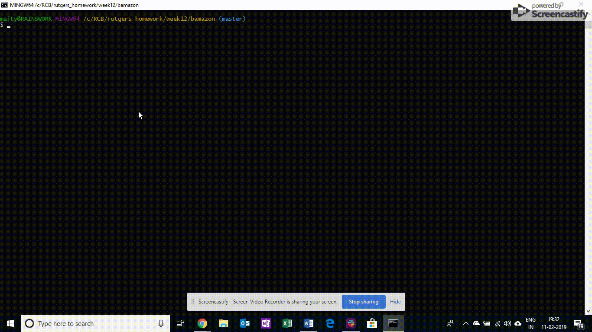

# bamazon

##Challenge #1: Customer View (bamazonCustomer.js)

The app will prompt users with two messages.
* The first should ask them the ID of the product they would like to buy.
* The second message should ask how many units of the product they would like to buy.
Once the customer has placed the order, the application should check if store has enough of the product to meet the customer's request. This means updating the SQL database to reflect the remaining quantity.
* Once the update goes through, show the customer the total cost of their purchase
* If not, the app should log a phrase like `Insufficient quantity!`, and then prevent the order from going through.
Type 'node bamazonCustomer.js'

##Challenge #2: Manager View (bamazonManager.js)

This node app will show a set of menu options:
* View Products for Sale
* View Low Inventory
* Add to Inventory
* Add New Product
Type 'node bamazonManager.js'

##Challenge #3: Supervisor View (bamazonSupervisor.js)
This node app will show a set of menu options:
* View Product Sales by Department
* Create New Department
 When a supervisor selects `View Product Sales by Department`, the app should display a summarized table in their terminal/bash window
 Type 'node bamazonSupervisor.js'

